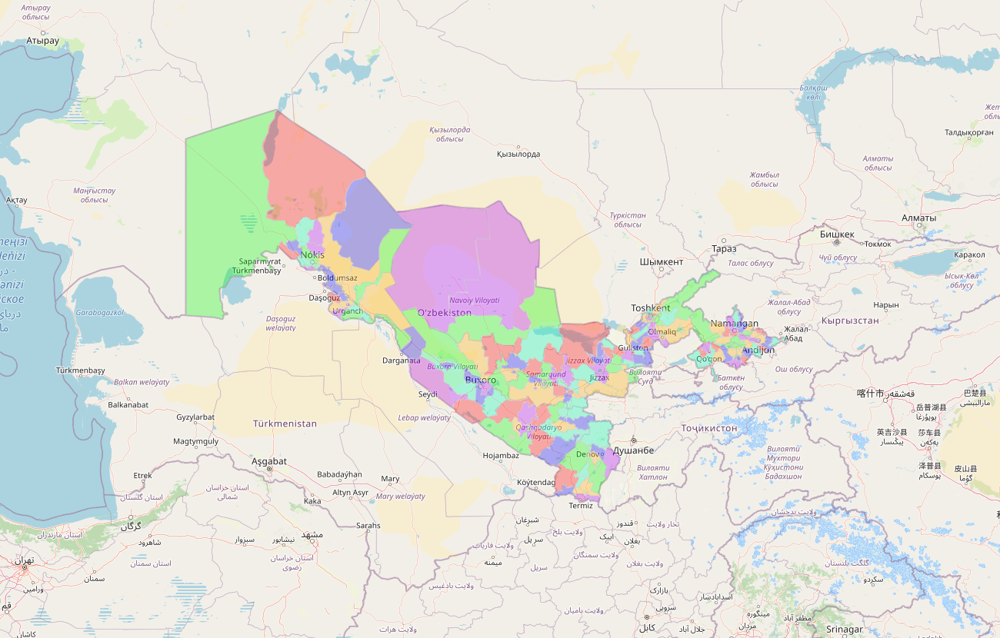

<div style="width: 70%; margin: 0 auto;">
<h1 style="text-align: center">GeoPortal | Gis</h1>
    
</div>

## Table of Contents

- [Description](#description)
- [Installation](#installation)
- [Usage](#usage)
- [Contributing](#contributing)

## Description

This project is a simple web application that allows users to view and interact with a map. The map is powered by
the [Leaflet](https://leafletjs.com/) library and the data is provided by
the [OpenStreetMap](https://www.openstreetmap.org/) project. The application is built using
the [Flask](https://flask.palletsprojects.com/en/2.1.x/) and [Django](https://djangoproject.com) web framework and
the [Jinja](https://jinja.palletsprojects.com/en/3.0.x/) templating engine. The application is designed to be simple
and easy to use, with a clean and intuitive user interface.

## Installation

To install the application, follow these steps:

1. Clone the repository to your local machine using the following command:

```bash
git clone https://github.com/husanIbragimov/GeoPortal.git
```

2. Change into the project directory:

```bash
cd GeoPortal
```

3. Pull the flask or django branch from origin:

```bash
git pull origin flask
```

or

```bash
git pull origin django
```

4. Switch to the flask or django branch:

```bash
git checkout flask
```

or

```bash
git checkout django
```

5. Install the required dependencies using the following command:

```bash
pip install -r requirements.txt
```

6. Run the application using the following command:

```bash
python run.py
```

or

```bash
python manage.py runserver
```

## Usage

To use the application, follow these steps:

1. Open a web browser and navigate to the following URL:

```browser
http://127.0.0.1:8000/
```

2. Use the map controls to zoom in and out, pan, and interact with the map.
3. Click on the map to view information about the location you clicked on.

## Contributing

...


Follow me on [LinkedIn](https://www.linkedin.com/in/husanibragimov/), [Twitter](https://twitter.com/husanibragimov_) and [Instagram](https://www.instagram.com/husanibragimov_/)
